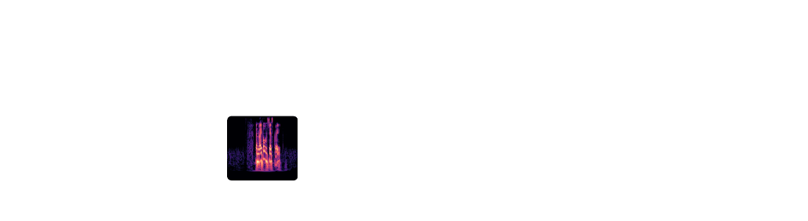

## Deepfake Audio Detection


<p align="center">
    
</p>

[](https://www.python.org) [](https://www.tensorflow.org) [](https://keras.io)  [](https://scikit-learn.org/stable/) [](https://numpy.org) [](https://pandas.pydata.org)  [](https://librosa.org/doc/latest/index.html#) 


### Setup
Install the required dependencies. Download the GPU version of these package if required.
``` bash
pip install -r requirements.txt
```
Download and unzip AsvSpoof 2019 LA files

```bash
wget https://datashare.ed.ac.uk/bitstream/handle/10283/3336/LA.zip
unzip LA.zip
```

This should give you the following dir:
``` bash
audio-deepfake
├── LA
│   ├── ASVspoof2019_LA_asv_protocols
│   ├── ASVspoof2019_LA_asv_scores
│   ├── ASVspoof2019_LA_cm_protocols
│   ├── ASVspoof2019_LA_dev
│   │   └── flac
│   ├── ASVspoof2019_LA_eval
│   │   └── flac
│   └── ASVspoof2019_LA_train
│       └── flac
└── src
    ├── feature.py
    ├── metrics.py
    ├── augment.py
    ├── model
    ├── protocol
    ├── requirements.txt
    └── run.py

```

Before running the experiment, remember to change the path to include your uniqname:

```
path_to_database = "/home/[uniqname]/audio-deepfake-detection/" + access_type
```

Train the model and evaluate on AsvSpoof 2019 eval dataset by the following command. EER, Accuracy, F1, precision, recall and auc score are provided.

``` bash
python run.py \
    -m 'lcnn' \
    -f 'cqt' \
    --lr 0.00001 \
    --epochs 100 \
    --batch 32 \
```

Before you run the experiement on the full dataset, you can set the dataset size to 1000 and verbose to 1 for quick verification.
```bash
python run.py \
    -m 'lcnn' \
    -f 'cqt' \
    --lr 0.00001 \
    --epochs 100 \
    --batch 32 \
    --datasize 1000 \
    --verbose 1 \
    --savedata False \
```

Aditionally, you can use the augment.py code to perform data augmentation. When training the model, just add the `--augment 1` argument.

